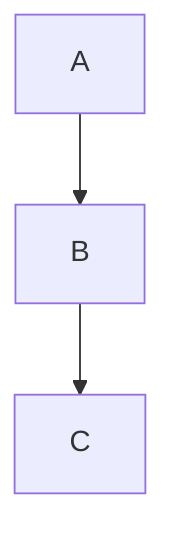
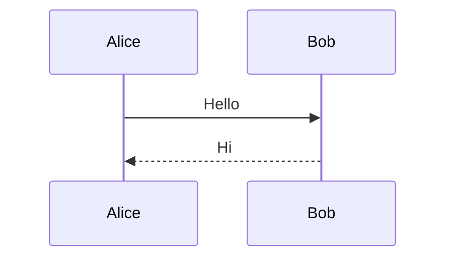
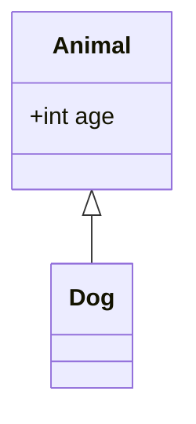
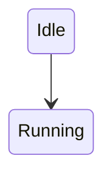
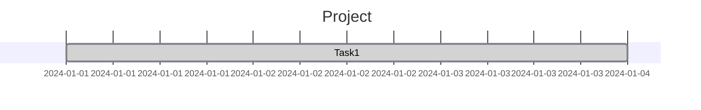

# How to use Mermaid Diagram in Obsidian

## What is Mermaid

**Mermaid** is a text-based diagram tool. You write simple syntax, and it renders diagrams automatically (Markdown, Obsidian, GitHub, etc.).

## Basic usage

Wrap Mermaid code in a fenced block:

````

````

### Common diagram types

**Flowchart**


**Sequence diagram**



**Class diagram**



**State diagram**



**Gantt**



## Customize Diagram Size

I often find that my Mermaid diagram is too long to fit in Obsidian page size. Instead of zooming out, use Obsidian CSS script.

```css
.markdown-preview-view .mermaid svg {
    max-width: 100%;
  }
```

This auto-scale Mermaid diagrams to page width.

Now it's done. Try out Mermaid in your vault!